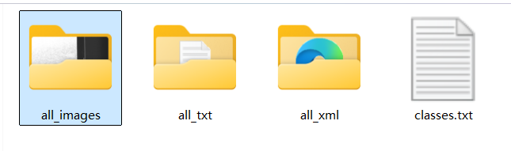
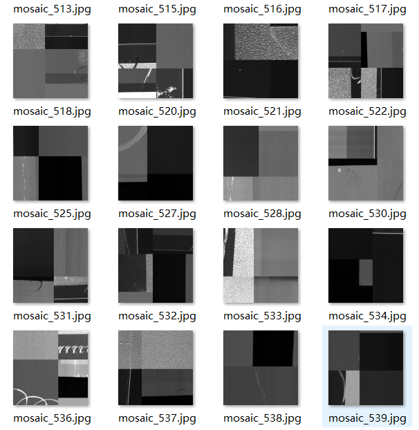
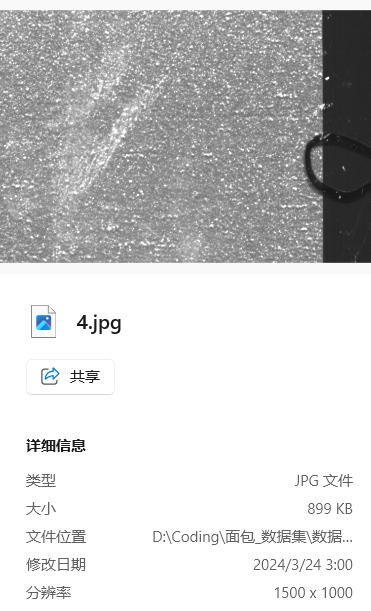
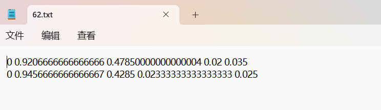
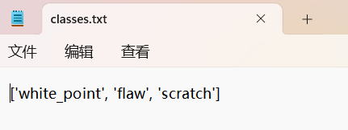
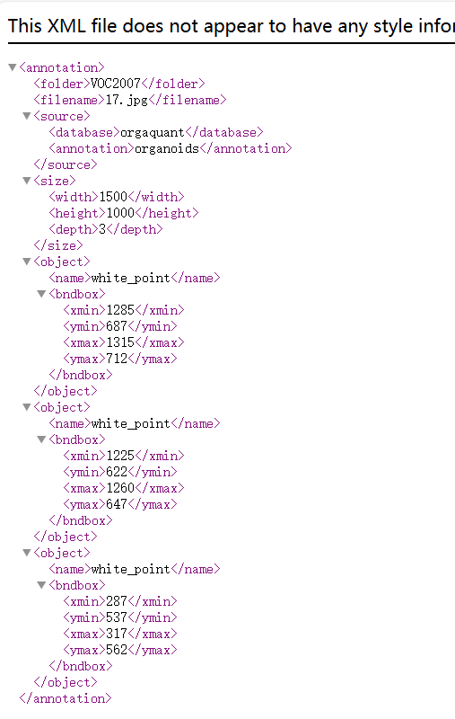
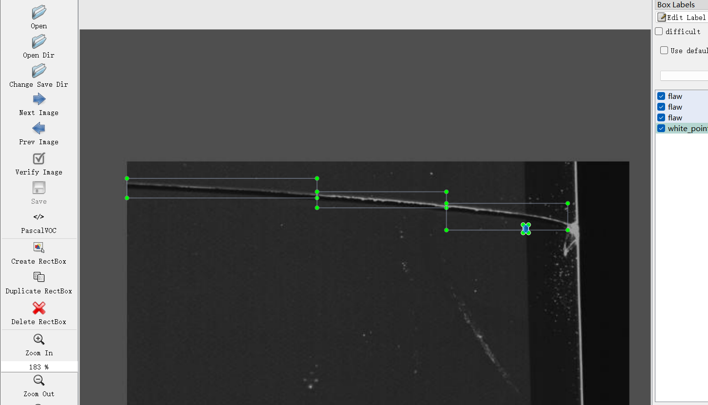

# Screen Defect Detection - Object Detection Dataset

Dataset Information Introduction: The dataset consists of 3789 images and corresponding annotations. The annotations are provided in two formats: VOC-formatted xml files and YOLO-formatted txt files. The objects annotated include:
- white_point (white spots)
- flaw (cracks)
- scratch (scratches)

The number of bounding box annotations is as follows:
- white_point: 2222
- flaw: 5127
- scratch: 2256

Note: An image may contain multiple annotated objects, so the total number of bounding box annotations may exceed the number of images.

The complete dataset consists of three folders and one txt file:
- all_images folder: stores the dataset's images, screenshots included:

Image Size Information:
- all_txt folder and classes.txt: store the YOLO-formatted txt annotations, in the same quantity as the images, with each annotation file corresponding to an image.
- classes.txt:
- For a detailed understanding of the YOLO format standard file, please search for it yourself on Baidu. In short, index 0 represents the name at position 0 in the array in classes.txt.

- all_xml folder: VOC-formatted xml annotations.
- The quantity and images are the same, with each annotation file corresponding to an image.
- For a detailed understanding of the VOC format standard file, please search for it yourself on Baidu.

Both formats of annotations are usable; choose one of them based on your preference.
Annotation Screenshots:

## Images

Here is a pay link on Stripe ( https://buy.stripe.com/3cs8yP7sY87d0vu9AB ). Please contact me lonlonago@foxmail.com after funding $89, and I will send you a complete data files , thank you!

